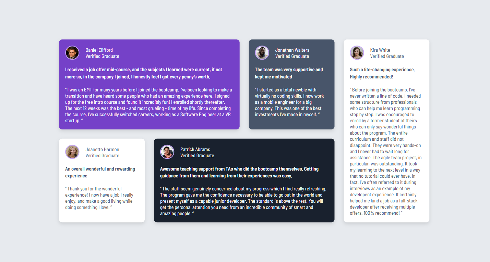

# Testimonials grid section — Frontend Mentor solution



## Overview

A responsive testimonials grid section built to match the Frontend Mentor "Testimonials grid section" challenge. The layout adapts from a single-column mobile layout to a multi-column grid on larger screens using CSS Grid and Flexbox.

### The challenge

Users should be able to:

- View the optimal layout for the site depending on their device's screen size

This project reproduces the design provided in the `/design` folder and uses the assets in `/images`.

### Screenshot


## Links

- Solution URL: https://github.com/devEbuka/Testimonials-Grid
- Live Site URL: https://devebuka.github.io/Testimonials-Grid/
- Challenge: https://www.frontendmentor.io/challenges/testimonials-grid-section-Nnw6J7Un7

## My process

### Built with

- Semantic HTML5
- CSS custom properties (variables)
- Flexbox
- CSS Grid
- Mobile-first responsive workflow
- Google Fonts — Barlow Semi Condensed

### What I learned

- How to combine CSS Grid and Flexbox for complex card layouts.
- Using CSS custom properties to centralize colors, spacing and typography.
- Mobile-first breakpoints and rearranging grid items on larger screens (different grid-column / grid-row placements).
- Simple, clean semantic HTML structure makes the layout easier to style and maintain.

Example — grid layout rules from `styles.css`:

- At >= 600px: 2-column grid using `grid-template-columns: repeat(2, 1fr)`
- At >= 1024px: 4-column grid with items spanning multiple columns/rows for the featured testimonial

### Continued development

- Improve accessibility: add descriptive `alt` text for profile images and check color contrast for WCAG compliance.
- Refactor CSS to use a component or utility-based approach (BEM or CSS Modules) for larger projects.
- Add automated visual regression tests or a simple style guide page showing tokens and components.

### Useful resources

- Frontend Mentor challenge: https://www.frontendmentor.io/challenges/testimonials-grid-section-Nnw6J7Un7
- Project style guide included in this repo: `style-guide.md`
- CSS Grid guide: https://css-tricks.com/snippets/css/complete-guide-grid/

## How to run

This is a static site — no build step required.

1. Open `index.html` in your browser (double-click or use your editor's "Open in Browser" feature).
2. Or serve it locally with a simple static server (optional). Example using Python 3 in PowerShell:

```powershell
python -m http.server 8000
# then open http://localhost:8000 in your browser
```

## Folder structure

- `index.html` — main HTML file
- `styles.css` — main stylesheet
- `images/` — project images and assets
- `design/` — design references (mobile & desktop)

## Author

- Your Name — Okonta Chukwuebuka
- Frontend Mentor - 

## Acknowledgments

Thanks to Frontend Mentor for the challenge and the design resources. Feel free to open an issue or PR if you'd like to suggest improvements to this repo.

---

